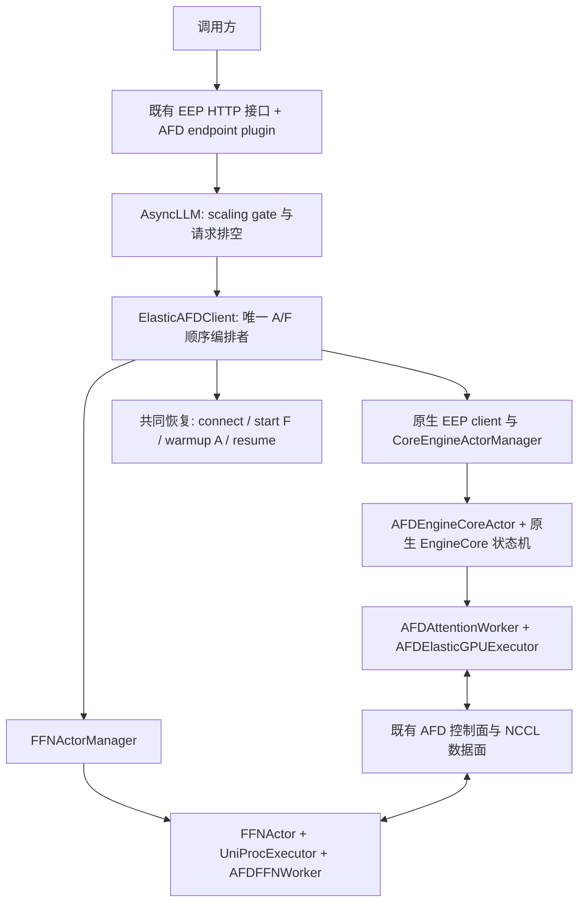
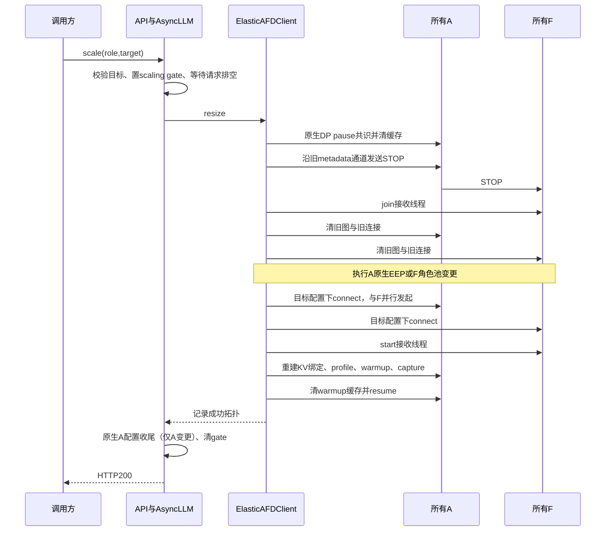

# EAFD 软件需求与设计规格说明书

| 文档控制项 | 内容 |
| --- | --- |
| 文档编号 / 版本 | EAFD-SDS-001 / 1.0-review |
| 日期 | 2026-09-23 |
| 状态 | **工程评审稿，待用户审查**；不是已批准的上线规格 |
| 适用实现 | `feat/elastic-afd-eep`，生产代码基线 `990922a6bbc7896d1b64387907d727b69e6837ee` |
| 最近 GPU 验证的生产代码 | `665cd0a451f74a46fa869834d5854b6864403a85`；其后至 `990922a` 仅文档变化 |
| vLLM 基线 | v0.26.0，`568afb3a13806beb53bb2e6bd518269357b237c0` |
| afd-plugin 起点 | `8bb14be66d9f940b1b132b141d986214c0210353` |
| 关联变更 | [PR #2](https://github.com/gaidandawang-afk/afd-plugin/pull/2) |
| 文档范围 | 需求、总体和详细设计、接口、资源生命周期、异常、部署、验证、风险及评审决策 |

本文是当前 EAFD 的统一设计评审入口，先说明行为与约束，再给出实现定位。
它以固定版本源码及保存的运行证据为依据，不把实现前方案、静态 AFD 能力或
其他 vLLM 版本的能力直接当作本版交付能力。

“必须”表示设计约束；“当前实现”说明代码事实；“已验证”必须注明验证范围。
尚未满足的要求和建议统一登记为 `GAP-*` 或 `DEC-*`，不得据此声称代码已实现。
这是一份合并的工程规格，不宣称通过某项外部标准认证。

## 阅读导航

| 评审目的 | 阅读章节 |
| --- | --- |
| 先判断方向与边界 | 1–4：设计摘要、需求、约束与架构 |
| 判断接口和执行是否正确 | 5–8：接口、启动/扩缩、EEP、EPLB |
| 判断图、DBO、KV 和资源是否安全重建 | 9–10 |
| 判断是否具备交付条件 | 11–14：失败、部署、测试、待决策项 |
| 最后再对应代码 | 15–16：旧设计演进、变更清单与维护边界 |

## 1. 设计摘要

EAFD 在已有 AFD 服务上，支持运行期间分别改变 Attention（A）和 FFN（F）
的 DP 规模。A 的创建、移除、DP 同步及路由更新复用 vLLM EEP；F 使用独立
Ray actor 池。跨角色的数据面停启由一个 `ElasticAFDClient` 顺序编排。

一次变更仅调整一侧：`/scale_elastic_ep` 默认操作 A，`role=ffn` 操作 F。
首版接受停止接收新请求、排空已有请求、清理 KV、重载目标角色模型以及重新
捕获 CUDA Graph。它提供有停顿的规模调整，不承诺不中断接入或保留 KV。

当前可交付给评审的实现范围是 **GPU、MRV1、TP1、同步 P2pNccl connector、
A DP>=2、F DP>=1、A ranks>=F ranks**。Eager、eager DBO、decode CUDA Graph、
decode CUDA Graph+DBO 均有至少一个规定范围内的硬件功能用例通过。

必须把下面三件事分开：

1. **架构已实现**：A/F 独立扩缩、EEP 接入、正常路径生命周期。
2. **功能已验证**：特定模型、参数、拓扑链上的推理和资源检查。
3. **仍未完成的交付条件**：完整精度、多轮稳定性、持续流量下排空、整体操作
   超时、破坏性变更失败后的可靠拒新等。详见 11、13、14 章。

## 2. 背景、术语与需求

### 2.1 背景与用户已确定的约束

旧版基于 vLLM 0.13 的 EEP M1，在修改后的 vLLM/vLLM-Ascend 仓库中管理
A/F 弹性，主要接口使 A/F 按相同规模变化。现在 AFD 迁入独立插件，EEP 改为
EngineCore 驱动的阶段状态机，需要重新确定扩展边界。

用户已确定：复用 EEP 的 A 流程；F 独立编排；统一沿用 EEP API 并增加角色
参数；第一版允许模型重载、KV 丢弃；只覆盖所选 AFD/EEP 组合的可行范围。
后续又明确要求支持 GPU 图模式和 DBO，这两项已纳入本版。

### 2.2 术语

| 术语 | 本文定义 |
| --- | --- |
| A / F | Attention 角色 / FFN 角色；A 还持有其模型路径所需 embedding、norm、输出等参数 |
| DP size | 目标角色的数据并行规模；API 的整数表达该值 |
| A/F ranks | `A_DP × A_TP` / `F_DP × F_TP`；当前 TP1 时与 DP 数相同 |
| EP | 专家并行；F 按其角色组构建专家布局 |
| EEP | vLLM Elastic Expert Parallelism 的控制流程和执行状态机 |
| EPLB | Expert Parallel Load Balancing；运行中的专家负载均衡与重排，本版关闭 |
| DBO | vLLM 原生 Dual Batch Overlap；本版使用两个 ubatch |
| STOP | 在既有 AFD 有序 metadata 通道上传递的停止接收循环控制消息 |
| READY | 原生引擎构造握手，不等于 AFD 数据面就绪 |
| EEP 完成 | 每个目标 A EngineCore 的 `eep_scaling_state is None` |
| 服务恢复 | A/F 连接、F 接收循环、A warmup/capture、缓存重置均完成，scheduler 恢复 |

### 2.3 功能需求与追溯

| 编号 | 必须提供的行为 | 设计位置 | 当前证据 |
| --- | --- | --- | --- |
| FR-01 | 通过插件集成固定版本，不修改 vLLM 源码树 | 4、16 | 插件构建/实际模块路径、入口检查 |
| FR-02 | 沿用 scale 接口；省略 role 时操作 A，显式 ffn 时操作 F | 5 | API 单测；A/F 四类硬件变更 |
| FR-03 | A 扩缩复用 EEP 状态、通知、ActorManager 和路由 | 7 | 接缝单测；新增 A 推理计数 |
| FR-04 | F 扩缩不改变 A DP 数或 A actor 身份 | 6.4、8 | F-only Actor/PG 和推理证据 |
| FR-05 | 变更前拒新、排空并达成 DP pause，再 STOP/join F | 6、9 | 顺序单测；空载阶段硬件成功；持续流量验证待补 |
| FR-06 | 旧图先于旧 communicator 释放，所有目标角色就绪后恢复 | 9 | 生命周期单测；逐 worker 图事件 |
| FR-07 | 新增/保留角色使用目标拓扑的配置、权重和通信 | 6、8、10 | Actor/PG、当前 DP 元数据、真实推理 |
| FR-08 | 支持 eager、decode 图、双 ubatch DBO 及组合 | 9 | 四类模式的规定用例；图 mode0 范围 |
| FR-09 | 业务变更前拒绝无效角色、规模与明确不支持的配置 | 3、5 | 配置/API 单测 |
| FR-10 | scale 过程中查询 scaling 状态；禁止并发变更 | 5、10 | API/middleware/gate 单测 |
| FR-11 | 清理只涉及该 client 拥有的 F actor、placement 和 connector 资源 | 10–12 | teardown 单测与运行后独立资源检查 |
| FR-12 | 非 AFD 调用保持原生处理路径，AFD 专属豁免不扩大为普通 EEP 豁免 | 4、16 | 委托/配置单测；跨版本及完整非 AFD 回归未完成 |

### 2.4 非功能需求

| 编号 | 要求 | 当前边界 |
| --- | --- | --- |
| NFR-01 正确性 | 不能在新旧拓扑混用的状态接入新业务 | 正常路径有 gate/pause；变更失败后的持久拒新不足，GAP-01 |
| NFR-02 时间 | 排空必须受限；部署方必须能识别长期未完成的变更 | drain 有超时；整体 deadline 缺失，GAP-02；没有扩缩时延 SLO |
| NFR-03 资源 | GPU/模型路径/通信对象必须有明确所有者 | 实现明确；资源不足前置检查和长期泄漏资格验证待补 |
| NFR-04 可观察 | 能区分进行中、成功、失败，并保存版本、拓扑、请求和资源证据 | 测试项目证据完整度较高；生产 API 只有一个 scaling 布尔值 |
| NFR-05 可维护 | 限定版本兼容补丁，保留原生状态机，变更可定位、可测试 | 已实现；升级必须逐项复审，不能只改版本号 |
| NFR-06 性能 | 功能正确后再验证 DBO 性能收益及停顿成本 | 现有耗时仅观测值；未进行准确率/吞吐/尾延迟基准 |

### 2.5 明确排除

本版不实现自动扩缩策略、同时改变 A/F、跨请求事务、幂等任务 ID、自动重试、
自动回滚、节点替换、在线专家权重迁移、KV 保留、按需权重加载或无停顿扩缩。
TP>1、NPU 弹性、PD/KV transfer、MRV2、A DP=1 也不属于当前已实现范围。
“不做回滚”不自动解决失败后的服务隔离问题，后者仍需要审查 DEC-01。

## 3. 支持矩阵与配置约束

### 3.1 当前实现契约

| 项目 | 约束 |
| --- | --- |
| 后端 | CUDA，`P2pNcclAFDConnector`，同步 AFD DP |
| 引擎 | MRV1，在线 generate；一个 API 进程、内部 DP LB |
| 执行方式 | `data_parallel_backend=ray`；角色内 `distributed_executor_backend=uni` |
| 并行维度 | A_TP=F_TP=PP=PCP=DCP=1 |
| 拓扑 | A_DP>=2，F_DP>=1，A ranks>=F ranks |
| MoE | EP 开启、EPLB 关闭；实际模型/算子仍受静态 AFD 限制 |
| DBO | 开 `enable_dbo`；沿用原生两个 ubatch；不接独立任意 ubatching 配置 |
| 图 | 仅 `FULL_DECODE_ONLY`；当前硬件资格为 mode0；mode3 配置允许但未验；mode1 拒绝 |
| KV | 显式正数 `kv_cache_memory_bytes`；当前验收每 A 1 GiB |
| 其他禁用项 | speculation、LoRA、KV transfer、sleep、外部/混合 LB |
| 插件 | `VLLM_PLUGINS=afd,afd_elastic`；显式 AFD attention worker；`VLLM_USE_V2_MODEL_RUNNER=0` |

模型支持不能只由上述 validator 推导。本版未建立所有模型的资格白名单；目前
硬件验证模型为 DeepSeek-V2-Lite-Chat BF16。没有被 validator 拒绝的模型、
量化、gate 位置和部署方式，仍可能不受其静态 adapter 支持或尚未验证。

### 3.2 拓扑合法性

当前 GPU connector 将 Attention rank `a` 分配给 F rank `floor(a × F / A)`，
支持已有的不均匀分组，不要求 A/F 整除。本版不新增映射算法。

| 拓扑 | 配置判定 | EAFD 当前硬件证据 |
| --- | --- | --- |
| 2A2F、2A1F、3A1F | 合法 | eager DBO、图+DBO 混合链通过 |
| 4A2F | 合法 | eager A-only 扩缩通过；不代表其图+DBO 已验 |
| 3A2F | 合法非整除 | 未验；3A1F 不能作为非整除证据 |
| 1A1F | 静态 AFD 可用，本版 EAFD 拒绝 | 无本版单 A client/跨 1↔2 切换资格 |
| 2A3F | 不合法 | A ranks<F ranks，变更前拒绝 |

API 中的目标 F 数不是复制完整模型的池大小；F 模型在目标 F EP 组内分片。

## 4. 总体架构与模块职责

### 4.1 逻辑架构



### 4.2 职责分配

| 模块 | 所有的职责 | 不承担的职责 |
| --- | --- | --- |
| `elastic/api.py` | 角色参数、HTTP 映射、替换已有 scale route、启动 init_state、放行状态查询 | 不管理 actor 或直接操作 CUDA |
| `elastic/config.py` | 不可变 `ElasticTopology`、完整配置校验、拓扑派生 | 不做 Ray 容量调度 |
| `elastic/client.py` | 保存成功拓扑和 F manager；共同 prepare/finish；调用 A 或 F 变更路径 | 不复制 EEP 状态机，不管理 A 的另一份 actor 注册表 |
| `elastic/ffn.py` | F actor/placement 所有权、目标角色配置、初始化与释放 | 无请求 scheduler、DPCoordinator、FFN EngineCore/ZMQ 服务 |
| `elastic/ray_actor.py` | 继承原生 A actor，按实际 Ray bundle 设置可见 GPU | 不新建 A 生命周期框架 |
| `elastic/gpu.py` | Worker 动作、EEP 执行器适配、图/连接/KV/workspace 的生命周期 | 不决定 HTTP 成功，不创建另一套状态推进 |
| `compat/patches/elastic*.py` | 缺少官方 hook 处的固定版本接缝 | 不提供通用跨版本兼容层 |
| 既有 AFD runner/connector | 模型角色化、数据传输、metadata、DBO 与捕获/重放 | 不决定 A/F 目标规模 |

### 4.3 插件如何生效

1. `vllm.general_plugins` 中的 `afd` 安装已有 AFD 注册和 EEP 适配接缝。
   弹性相关 import 不在可静默吞掉的旧 optional-patch 分支内。
2. 弹性 worker 的完整配置在构造阶段检查；需 `additional_config.afd.role=attention`
   且 `enable_elastic_ep=True`，并显式指定受支持 A worker。
3. `vllm.endpoint_plugins` 中的 `afd_elastic` 替换既有 `/scale_elastic_ep` route，
   保留其依赖和响应元信息，避免追加一个被旧路由遮蔽的重复路径。
4. v0.26 在 `attach_router` 之后安装 scaling middleware，因此 middleware
   的 AFD 适配在 `init_state` 中进行；HTTP 开始服务前完成 AFD 首次恢复。
5. 普通非 AFD 的 Attention scale 委托原生 handler。EPLB 豁免只针对显式
   AFD Attention worker，不是全局取消普通 EEP 的前置条件。

仅仅安装 wheel 不等于弹性路径已激活；版本、插件选择、worker 与角色配置必须
同时满足。EAFD 接缝由 `afd` 注册时安装，其中复制的原生方法仍影响维护面，
因此非 AFD 回归也属于升级验收要求。

## 5. 外部与内部接口契约

### 5.1 POST /scale_elastic_ep

Content-Type 为 `application/json`。一次同步等待一个角色的变更完成。

| 字段 | 类型 | 缺省 | 语义 |
| --- | --- | --- | --- |
| `new_data_parallel_size` | JSON 正整数，布尔值不接受 | 必填 | 所选角色的目标 DP size |
| `role` | `attention` 或 `ffn` | `attention` | A/F 选择，不是同时变更 |
| `drain_timeout` | JSON 正整数，布尔值不接受 | HTTP=120 秒 | 仅等待已接收请求排空的期限 |

直接调用 Python `AsyncLLM.scale_elastic_ep` 时其默认 drain_timeout 为300秒。
HTTP 层显式传入120秒默认值，调用方不应混淆这两个入口。
当前只校验上述字段；额外 JSON 字段未被统一拒绝，没有独立的扩展版本协商。

```json
{"new_data_parallel_size":3,"drain_timeout":300}
```

把 `2A1F` 改为 `3A1F`。以下请求把 `2A2F` 改为 `2A1F`：

```json
{"new_data_parallel_size":1,"role":"ffn","drain_timeout":300}
```

成功响应 HTTP200：

```json
{"message":"Scaled ffn to 1 data parallel engines"}
```

**成功后置条件**：目标角色变更已完成；所有目标 A/F 连接恢复；F loop 已启动；
A warmup/capture 和缓存重置完成；A scheduler 已恢复；controller 成功拓扑已更新。
无变更请求在空闲时直接成功，不执行 STOP/restart。它不是重连测试入口。

### 5.2 错误与并发

| 情况 | 当前 HTTP/行为 | 调用方可作出的判断 |
| --- | --- | --- |
| JSON 非法、非对象、role/size/timeout 不合法 | 400 | 入口校验失败，未进入角色变更 |
| 目标拓扑违反本版约束 | 400 | 初始 `resize` 校验发生在 prepare 前 |
| 路径内部抛出 ValueError | 400 | 同一异常类型被统一映射；**不能仅凭400断定未发生修改** |
| 排空超时 | 408 | 此阶段尚未拆通信；scaling gate 在 finally 清除 |
| F STOP/join 等内部 TimeoutError | 408 | 当前不是专用错误码；可能已部分停止，需要结合日志 |
| scaling gate 已置位后的新 HTTP 请求 | 503 | 包含推理、scale、health、metrics；仅下节的 AFD 状态查询放行 |
| 已进入 handler 的并发调用 / 直接 Python 并发调用 | RuntimeError；HTTP 下通常为500 | 当前无统一409契约，也没有请求排队 |
| 其他异常 | 传播到 ASGI 异常处理，通常为500 | 不承诺回滚，见第11章 |

当前没有 operation ID、进度结果对象或重试幂等键；调用方断连/HTTP 超时不能
被当成“服务端未执行”。不应盲目重试已进入破坏性阶段的操作。

### 5.3 POST /is_scaling_elastic_ep

```json
{"is_scaling_elastic_ep":true}
```

它读取既有进程级 scaling flag。成功或异常返回时 flag 都可能变为false，
因此 **false 仅表示 gate 不再置位，不是成功、健康、当前拓扑或数据面就绪的证明**。
当前没有对外暴露 F 拓扑、操作阶段、失败原因和资源状态的专用 API。

### 5.4 启动配置

`additional_config.afd` 继续使用已有字段：role、connector、host、port、
num_attention_ranks、num_ffn_ranks 等。动态 rendezvous 地址由 F0 所在节点分配
并传播，不能各个 worker 自行递增端口。

`additional_config.afd_elastic` 当前仅接受 `ffn_tensor_parallel_size`，缺省1；
当前值也只能为1。初始 F_DP 从 `num_ffn_ranks / F_TP` 得到。没有第二个
`enabled` 开关，也没有重复的 A/F target 字段。

### 5.5 内部管理接口

| 接口 | 所在层 | 契约 |
| --- | --- | --- |
| `initialize_afd()` | AsyncLLM | 非弹性 AFD 返回false；弹性启动创建 controller 并等待共同恢复 |
| `afd_eep_complete()` | EngineCore utility | 只读非阻塞返回 state 是否为空；不能在其中等待本引擎自己推进 |
| `afd_reset_after_warmup()` | EngineCore utility | 要求 PAUSED_ALL 且无 running/pending pause，清原生缓存 |
| `afd_send_stop()` | A Worker RPC | 通过 connector 的指定 sender 发送 STOP，随后设备同步 |
| `join_ffn_server_loop(timeout=60)` | F Worker RPC | 等待 STOP 后的线程退出；超时不丢弃存活线程句柄 |
| `afd_release_link()` | A/F Worker RPC | 无 forward 前提下释放图与连接资源 |
| `afd_update_topology(mapping)` | A/F Worker RPC | MessagePack 后按 dict 恢复 AFDConfig，更新 runner/model 引用 |
| `afd_connect()` | A/F Worker RPC | 使用目标一致配置创建连接；所有参与者必须并行发起 |
| `start_ffn_server_loop()` | F Worker RPC | 启动已有后台线程并返回，不用永久阻塞 Ray actor 方法 |
| `afd_finish()` | A Worker RPC | 重建 KV 绑定、profile/warmup/capture、同步设备 |

管理 RPC 只面向本部署内部的可信参与者，不是稳定的外部公共 API。

## 6. 启动和四类扩缩详细设计

### 6.1 首次启动

1. 校验角色和运行配置，安装插件入口及 EEP 适配。
2. 原生 Ray A manager 创建 A actor/EngineCore。A 加载其 checkpoint 和 KV
   几何，但将需要 F 的 connector、profile、warmup/capture 延迟。
3. 每个 A 完成原生 READY 后置 `PAUSED_ALL`、禁止启动 DP wave；该 READY
   不能触发业务或依赖 F 的 dummy forward。
4. HTTP 启动前，endpoint `init_state` 调用 `initialize_afd()`。
5. controller 创建 F actors，在 F0 节点取得 AFD link port 与 F role port，
   派生相同拓扑的各角色配置，并并行初始化所有 F。
6. 全部 A/F 并行 connect；启动全部 F 接收线程；全部 A 进行 profile/warmup/
   capture；清理 warmup 缓存，恢复 scheduler；HTTP 才开始服务。

显式设置 KV 字节数本身不足以延迟 native profile；A worker 的 deferred 分支
还需要直接返回预算、暂缓 warmup，并保留 `CompilationTimes` 的原返回契约。

### 6.2 公共前置与恢复



图中的阶段是说明执行顺序，不是新增的持久状态机或事务日志。排空同时检查
frontend unfinished requests、client reqs_in_flight 和 DP engines running，
避免只看滞后的 coordinator idle 状态。AFD 强制排空，不依赖用户打开原生
可选 drain 环境变量。

### 6.3 A 扩容与缩容

**共同规则**：F 的角色 DP/EP 和模型权重保持不变；更新 F 对 A 拓扑的认识，
重建全部 A/F 数据面。A scale 路由和 stats logger 的变更由原生 AsyncLLM/EEP
路径完成；F 分支不触发这些 A size 更新。

| 项目 | A 扩容 | A 缩容 |
| --- | --- | --- |
| actor/placement | 原生 manager 新增目标 A，保留旧 A 身份 | 原生 EEP 移除目标外 A，保留目标内 A |
| EEP 参与者 | 旧 A、新 A | 保留 A、移除 A |
| A 模型 | 新 A 加载 checkpoint；保留 A 切组后重构 runner 并加载其角色参数 | 保留 A 切组后重构/加载；移除 A shutdown |
| F 模型 | 保留 | 保留 |
| 完成条件 | 原生 client 返回后，继续等待全部目标 A 的 state 清空 | 同样等待目标 A 完成；移除通知和 actor 回收沿用原生 |
| 后续 | 统一 connect、F start、A finish、resume | 相同 |

`RECONFIGURE_FINISHED` 早于所有 EEP 末尾状态完成，不能直接作为 AFD 重连边界。
controller 异步轮询 EngineCore utility，间隔0.01秒；不阻塞 EngineCore busy loop。
该轮询当前没有独立整体 deadline，属于 GAP-02。

### 6.4 F 扩容与缩容

1. 完成公共 prepare；此时所有旧 F 接收线程已退出、图与旧 A/F 连接已释放。
2. **所有旧 F** 执行 `release_role`：关闭 executor/model，清角色分布式环境。
3. 调整 F actor 池。缩容从末尾 rank 移除 actor/placement；扩容新建 actor/
   placement。保留 F 的 actor 身份可不变，其 executor/model 必须重建。
4. 为每个目标 F 深拷贝启动配置，设置新 F DP/EP、rank、master、worker 和
   实际 GPU 归属；全部并行初始化，按新布局从 checkpoint 加载角色权重。
5. A 权重保留，但更新其 F 拓扑及 connector；共同恢复会重建 A KV 绑定和图。
6. 完成共同 finish 后更新 controller 的 F size，返回成功。

不能仅在旧 F 模型对象上调用 `load_weights`：模型构造时已绑定旧 EP size、
expert_map、本地专家数与相关算子状态。F 不加入 A 的 EEP 状态机，
`enable_elastic_ep=False`，但其普通 EP 仍启用。

### 6.5 相同规模与无资源场景

相同目标直接返回成功，不创建 actor、不清缓存。真正的 STOP/restart 验证不能
用这种请求代替。扩容依赖可用 Ray GPU/CPU；当前 F `pg.ready()` 在拆除旧 F
运行时之后等待，未做完整容量预留或受限等待。生产使用须满足容量前提；
更强的资源失败语义待 DEC-01/DEC-02 确定。

## 7. EEP 状态机复用与接缝

### 7.1 M2 状态机仍由 reinitialize_distributed 进入

在本版 vLLM 0.26 中，`reinitialize_distributed` 仍存在，其职责包含建立
`ElasticEPScalingState`；后续由 EngineCore busy loop 调用 `state.progress()`。
它不再等价于旧 M1 的整段同步重初始化。本插件不复制状态枚举和推进函数。

| 原生参与者 | 状态序列（按0.26命名） |
| --- | --- |
| 扩容旧 A | WAIT_NEW_CORE_ENGINES_INIT → CREATE_STANDBY_GROUPS → TRANSFER_EXPERT_MAPPING → WAIT_NEW_CORE_ENGINES_WEIGHTS_INIT → TRANSFER_WEIGHTS → SYNC_KV_CACHE_MEMORY_SIZE → SWITCH_AND_PREPARE → EPLB_RESHUFFLE → COMPLETE |
| 扩容新 A | PRE_KV_INIT → PREPARE → EPLB_RESHUFFLE → COMPLETE |
| 缩容保留 A | PREPARE → EPLB_RESHUFFLE → SWITCH_AND_PREPARE → COMPLETE |
| 缩容移除 A | PREPARE → EPLB_RESHUFFLE → COMPLETE，并发送 SHUTDOWN_COMPLETE |

保留名为 `EPLB_RESHUFFLE` 的阶段，不意味着实际启用了 EPLB；阶段上的 barrier
和通知保留，具体 Worker reshuffle 动作为空。不能把保留同步与执行专家重排混为一谈。

### 7.2 Worker 动作替换表

| 原动作 | EAFD 实现 | 必须保留的语义 |
| --- | --- | --- |
| `load_model` | 从真实 checkpoint 加载 A 角色模型，延迟需要 F 的 forward | 新 A 的正常初始化握手 |
| `create_standby_groups` | 调用原 helper，`enable_eplb=False`，省略 MoE staging/suppression | 目标组参与者一致、原 barrier |
| `broadcast_expert_mapping` | 空操作；新 A loader 同时不执行原映射接收 | 两端一起取消，不能留下阻塞接收 |
| `transfer_weights` / `receive_weights` | 两端空操作 | 状态/通知和后续 KV 预算同步保留 |
| `prepare_new_worker` | 空操作，不向停止的 F 发起前向 | 原生 KV/scheduler 构造和 PREPARE 同步继续 |
| `switch_and_prepare` | 释放旧 runner、恢复 workspace、切目标组、更新配置、重建 A runner/模型/KV | group 切换、wave/step 与通知语义 |
| `perform_eplb_reshuffle` / scale-down 对应方法 | 空操作 | 原 state barrier 与 COMPLETE |
| `rewarm_workspace` | EEP 内不前向；实际 profile/warmup 移到共同 finish | F ready 后才能 forward |
| `switch_and_remove` | 释放 A runner，清 active group 引用 | 原生移除通知、manager 回收 |

## 8. EPLB、模型权重与布局

### 8.1 当前策略

A/F 均关闭 EPLB，启动显式要求 EP 开启。A 的 remote-experts 边界不持有 F 的
本地专家权重，不能把 A DP 当作 F 专家切分规模，也不伪造一个 EPLB 管理对象。

F 的专家布局由其目标 EP 组在构造模型时确定。F 扩缩通过 checkpoint 重建
目标分片；没有在线负载统计驱动的专家迁移、冗余副本重排或 EEP 权重 RPC 传输。

### 8.2 举例

假设某层64个专家，在被测 TP1、F EP2 组合中各 F 持有其分片。
`2A2F → 2A1F` 时，目标 F 以 EP1 重新构造模型并加载所有专家；反向变更时，
两个目标 F 都重新按 EP2 构造/加载分片。保留 Actor PID 不等于保留旧模型。

`2A1F → 3A1F` 时，F EP1 不变，F 权重不重载；A 角色按 EEP 新 DP 组重建。
本例说明布局归属，不是对任意模型、量化后端和专家数的通用资格承诺。

## 9. CUDA Graph、DBO、KV 与 workspace

### 9.1 生命周期不变量

| 编号 | 必须成立的约束 |
| --- | --- |
| INV-01 | 设置 HTTP gate 后排空已接收请求；执行资源拆除前达成所有 A 的 DP pause |
| INV-02 | STOP 使用旧的有序控制通道；F 收到 STOP 后先退出，不访问 batch 元数据或执行模型 |
| INV-03 | F join 成功之后才能拆其 communicator；线程退出后同步 CUDA |
| INV-04 | 旧图失效/释放在旧 communicator 销毁之前；不能只替换 Python connector 引用 |
| INV-05 | 全部目标 A/F 使用同一拓扑和 rendezvous；connect 的 collective 必须并行发起 |
| INV-06 | F 接收线程在 A profile/warmup/capture 之前就绪 |
| INV-07 | 任一旧/新增 A 在 EEP 中不得执行依赖 F 的前向 |
| INV-08 | EEP 所有目标终态之后才进入公共恢复 |
| INV-09 | A runner.shutdown 后、创建新 runner 前恢复 workspace；DBO 使用两个槽 |
| INV-10 | KV 保留的是配置快照，不是旧 tensor；新 allocator 路径必须完成全部 KV/input 初始化 |
| INV-11 | warmup 后清理 KV/block-table/prefix 状态，之后才 resume 和完成 scale |
| INV-12 | topology 成功记录不能在恢复完成前发布；中途配置修改不构成事务提交 |

### 9.2 图失效原因与清理范围

CUDA Graph 捕获的是设备地址、计算及通信调用；改变 Python 的目标 F 配置
不会修改已捕获图。例如 F=2 变为 F=1 后，旧图可能仍引用已销毁 communicator。
本版统一释放并重捕获，未采用跨重配置图复用。

公共 `release_link` 顺序：设备同步 → `gc.unfreeze()` → 清普通图 registry →
按角色清专属图/编译包装 → reset compiler、GC → 关闭旧 connector → empty cache。

| 角色 | 专属处理 |
| --- | --- |
| A 普通图 | `CUDAGraphWrapper.clear_all_graphs()`，重置模型 compile wrapper 和 pending AFD metadata |
| A DBO 图 | 额外调用 `UBatchWrapper.clear_graphs()`；外层双批 cache 不属于普通 registry |
| F 图 | reset 每个自管 graph，清 `_cuda_graphs`，将 `_graph_memory_pool` 置空 |

F-only 变更会保留 A 的模型 wrapper，因此外层 DBO cache 的显式清理是必要步骤。
本次资格配置无需替换进程全局 graph pool；这不构成其他编译模式/尺寸均无需额外
处理的结论。捕获完成也不等于真实请求发生过 replay，验收需单独观察。

### 9.3 DBO 执行与停机边界

沿用静态 AFD 的 `AFDUBatchWrapper`，两个 stage 分别携带自己的 AFD 元数据。
eager 使用原生双批执行；decode 图使用双批捕获/重放；低 token 数可回退单批。
F 依据同一控制 payload 中的 stage 元数据接收、执行或重放。

本版不新建 DBO Actor 或独立微批事务。依赖完整请求 drain、DP pause、F STOP/join
以及 CUDA 同步建立安全边界，而不是只等某一个 ubatch 结束。
native wrapper 的任务线程在对应调用返回前 join；仍须以设备同步收敛异步 CUDA 工作。

### 9.4 KV、workspace 与模型重载

- A 变更：旧 runner shutdown 会重置 workspace，随后按 DBO 开关恢复1/2个槽，
  再构造 runner、加载 checkpoint、走原生完整 KV 初始化。
- F-only：A 模型权重保留；共同 finish 清旧 KV 并从已保存的 KV 配置重新分配，
  清 block table，解锁 workspace，profile/warmup/capture 后再锁定。
- 两条路径都清除 warmup 对业务缓存的影响；不迁移旧请求 KV，不承诺 prefix 命中延续。
- 固定 KV1GiB 只是本轮验收配置，不是总显存上限。F=1 要能容纳完整专家权重及
  workspace、通信、捕获等开销。

## 10. 状态、资源所有权与一致性

### 10.1 实际存在的状态

| 状态/数据 | 所有者 | 作用与限制 |
| --- | --- | --- |
| 原生 scaling flag | 单 API 进程 | gate 和状态查询；无操作结果或阶段信息 |
| `ElasticAFDClient.topology` | client | 最近一次共同恢复成功后的拓扑 |
| A actors、run refs、A placements | 原生 CoreEngineActorManager | A 规模与生命周期的唯一管理者 |
| `eep_scaling_state` | 各 A EngineCore | 原生阶段状态；到终态后清空 |
| F actors/placements、启动配置副本 | FFNActorManager | F 池所有权；目标配置逐 rank 深拷贝 |
| deferred、KV 配置快照、runner | A Worker | 延迟前向及重建所需本地状态 |
| F thread/event/error | F Worker | 数据面执行线程及错误回传 |
| 图、接收 buffer、comm ID/PG | runner / connector | 当前拓扑的数据面资源 |

没有持久化 operation record、target epoch、事务日志、回滚快照或另一个 A 注册表。
controller 在成功前会修改若干运行配置和对象；`topology` 的晚更新不能使整个
操作具备原子性。失败时不能把它当作所有 worker 当前状态的权威一致快照。

### 10.2 分布式组与地址

三个域独立：A 的 EEP DP/device groups，F 的角色 DP/EP groups，以及跨 A/F 的
AFD connector groups。改变 A 规模不改变 F EP；改变 F 规模不调用 A EEP resize。

AFD world 按 F-first 排列，另有每 F 的数据 subgroup 和 DP metadata 控制组。
具体映射复用既有 connector。每次变更从 F0 节点获取新 link/role 端口并统一
分发；HTTP、Ray、A DP、F DP、AFD rendezvous 端口不能混为同一用途。
端口获取不是全局端口预留服务，bind 竞争属于运行时失败边界。

### 10.3 Ray 与退出

A 沿用原生 placement。TP1 下，A actor 从实际 GPU bundle 查询设备编号，
进程只暴露该 GPU；不根据 A rank 猜物理 GPU，也不把 F 已占卡数当作 A 本地 rank。

F 每 actor 申请一个 GPU 和一个 CPU 的 STRICT_PACK placement；Executor 在
Ray 设置设备后创建。正常 F 缩容先结束计算、释放角色，再 kill 被移除 actor
和释放对应 placement。进程最终退出允许对该 client 所有 F 强制清理，不等待
已经失效的 A 再发 STOP。client shutdown 和 finalizer 负责其 F 池。

测试 harness 的 PID/PGID 所有权清理属于验证环境，不等于产品实现了节点故障
恢复。产品不能借此声称任意崩溃都不会留下资源。

## 11. 失败语义与已知实现缺口

### 11.1 按阶段判断可恢复性

| 失败阶段 | 当前可能状态 | 当前处理 / 部署方动作 |
| --- | --- | --- |
| 完整配置/目标校验 | 尚未修改拓扑 | 返回错误，修正输入 |
| drain 超时 | 旧角色/连接未拆；已有请求可能仍在运行 | 返回408并清 gate；不声称强制终止已有请求 |
| pause / STOP / join 失败 | 部分角色可能已停，其他角色可能阻塞 | 不继续正常拆组；错误传播；重新部署前先检查 owned 进程 |
| 拆旧图/连接后失败 | 旧数据面已不可直接继续 | 当前没有回滚；需要整套服务重启 |
| 等待 Ray capacity、新组或 EEP 完成卡住 | 可能持续拒新或停留在半完成状态 | 缺统一 deadline/取消协议；运维侧观测和干预 |
| 目标 warmup/capture 失败或 OOM | 目标部分资源已经创建 | 不视为成功，重启整个服务 |
| API/client 进程崩溃或连接断开 | 结果不确定，未持久化操作身份 | 不能自动推断成功或安全重试；本版不提供自动恢复 |

这里“需要重启”是当前操作要求，不表示代码自动重启。

### 11.2 必须公开的缺口

| 编号 | 当前事实 | 影响 | 拟处理，尚未实现 |
| --- | --- | --- | --- |
| GAP-01 | scale 的 finally 在失败时也清 gate；无持久 FAILED 标记 | 破坏性失败后 false 不代表健康，新请求可能进入损坏的数据面 | 保留失败拒新直至重启，或由明确的服务致命退出契约接管；DEC-01 |
| GAP-02 | drain_timeout 只覆盖排空；F pg.ready 与最终 EEP 轮询无本层统一 deadline | 资源不足或局部失步可能无限期占用变更窗口 | 统一 deadline/阶段错误，确定超时后终止语义；DEC-02 |
| GAP-03 | F 扩容先释放旧角色再等待新增 placement | 无资源时旧服务也不能继续 | 评审是否在 prepare 前做资源检查/预留；不直接宣称已有两阶段提交 |
| GAP-04 | 400/408 可能来自内部阶段；并发 RuntimeError 没有专用HTTP映射 | 调用方难以只靠状态码判断是否可重试 | 规范阶段化错误，不改变已有成功接口；DEC-02 |
| GAP-05 | F 后台错误保存后由后续方法检查，缺独立生产 watchdog | 异步错误可能较晚暴露 | 定义可观察性和进程失败策略；不把测试 hook 当生产监控 |
| GAP-06 | 只验证单次规定链、同一短提示词 | 未覆盖权重完整性、长期稳定性和真实负载分布 | 固定输入集/精度基线、多轮变更和持续流量验收 |
| GAP-07 | 版本接缝依赖内部 API，注册层不是严格的全栈强制版本拦截 | 升级可能导入失败或行为漂移 | 固定环境、逐接缝 diff 和回归；版本闸门另行评审 |

GAP-01/02/03 是架构评审关注点，不因正常路径 smoke 通过而消失。本次文档整理
不擅自把“首版无回滚”改为新的恢复系统，也不将上述建议写成当前 API 保证。

## 12. 部署、安全边界与运行操作

### 12.1 前置条件

所有 Ray 节点使用一致的 pinned vLLM/plugin/模型配置；模型路径可读、GPU 可用，
具备最大目标规模的容量。原生 EEP A 扩容调用 `ray.util.state.list_nodes()`，
Ray Dashboard HTTP 必须可用；首次验证曾因关闭 Dashboard 失败，开启后通过。

API 和 Ray 管理面应由部署边界限制访问。当前插件不新增鉴权、租户隔离或
细粒度操作授权；scale 能改变 GPU 使用和中断接入，应作为受控管理接口。
单机验证绑定 loopback；跨机部署必须另行验证地址可达性和节点配置。

### 12.2 已验证启动参数形态

在已建立的独立 Ray 集群中，启动单个 A 服务，F 由插件创建：

```bash
export VLLM_PLUGINS=afd,afd_elastic
export VLLM_USE_V2_MODEL_RUNNER=0

vllm serve "$MODEL" \
  --served-model-name elastic-afd \
  --worker-cls afd_plugin.v1.worker.AFDAttentionWorker \
  --enable-expert-parallel --enable-elastic-ep \
  --data-parallel-backend ray --distributed-executor-backend uni \
  --data-parallel-size 2 --data-parallel-size-local 2 \
  --tensor-parallel-size 1 \
  --enable-dbo --dbo-decode-token-threshold 2 --dbo-prefill-token-threshold 2 \
  --compilation-config '{"mode":0,"cudagraph_mode":"FULL_DECODE_ONLY","cudagraph_capture_sizes":[1,2,4,8,16]}' \
  --max-cudagraph-capture-size 16 \
  --max-model-len 2048 --max-num-seqs 16 --max-num-batched-tokens 2048 \
  --gpu-memory-utilization 0.35 --kv-cache-memory-bytes 1073741824 \
  --host 127.0.0.1 --port 8000 \
  --additional-config '{"afd":{"role":"attention","connector":"P2pNcclAFDConnector","num_attention_ranks":2,"num_ffn_ranks":2},"afd_elastic":{"ffn_tensor_parallel_size":1}}'
```

端口8000仅作示例，实际验收用任务独占端口。模型必须使用已安装运行时能加载
的本地配置；完整实际命令、Ray 启动、观测扩展和清理在验证仓库用例中。
该参数集用于功能验证，不作为生产吞吐或显存利用率推荐。

### 12.3 监控与操作约束

- scale 期间 health/metrics 同样会被503拦截，部署方须评审探活和代理超时策略。
- 成功应同时检查 HTTP200、scaling=false、每个目标 A 的真实推理；失败后不能
  只看到 scaling=false 就继续业务。
- 没有目标 F 拓扑 API；当前运维验证依赖 actor/placement、worker 元数据及日志。
- A 扩容沿用原生统计 logger 重建，指标可能重置或保留旧 engine label；不能
  将跨拓扑计数器单调性当作契约。验收按阶段取基线，并只判断当前活跃 A。
- 单卡50%限制由本轮测试的采样 guard 保护，**不是生产 allocator 的硬配额**。
  产品启动参数 `gpu_memory_utilization` 和显式 KV 也不构成完整进程显存硬上限。
- 原始测试证据保留版本、源码提交、模块路径、命令、HTTP、Actor/PG、图/DBO事件、
  显存采样和最终清理；测试 hook 仅在验收运行通过 worker extension 安装。

## 13. 验证方案、结果与验收准则

### 13.1 当前证据分层

| 层级 | 当前结果 | 能证明什么 / 不能证明什么 |
| --- | --- | --- |
| 单元与接缝 | 最近针对性组合98 passed、4 skipped；早期较宽组合153 passed、15 skipped | 配置、接口、顺序、RPC编解码、所有权与回归；不能证明设备collective正确 |
| 完整本地套件 | 未全绿：缺本地torch/vLLM、POSIX差异及已记录既有失败 | 不宣称整个仓库测试通过 |
| 初始 eager | 2A1F启动和真实推理通过 | 初始跨角色恢复 |
| eager F-only | 2A2F→2A1F→2A2F通过 | A身份保留、F布局重建 |
| eager A-only | 4A2F→2A2F→4A2F，48/48推理 | 新A接入、F身份保留 |
| 普通图 | 2A2F→2A1F→3A1F→2A1F→2A2F，80/80 | 每活跃A真实请求图replay、F窗口replay和旧图释放 |
| eager DBO | 同链85/85 | 每活跃A的prefill/decode双批及低负载fallback |
| 图+DBO | 同链85/85 | 每活跃A的双批图ID与真实请求replay关联，F两stage、重捕获 |
| 完整文本离线比对 | 上述三轮共250条文本逐字一致 | 同一短提示词在模式/拓扑前后的一致性；不是完整准确率或logits检查 |

最后一项是保存响应后的离线补查；原运行用例主要断言非空、长度和部分答案前缀。
不能将离线发现描述成此前就存在的全量自动精度 gate，也不能用同一运行的输出
自选为正确答案并据此声称准确率通过。

### 13.2 图+DBO 运行记录

- 产品提交 `665cd0a`；run `elastic-dbo-graph-20260922.graph001.1790058262846438000`。
- 2026-09-22 UTC06:24:35–06:28:52；H20 GPU4–7；DeepSeek-V2-Lite-Chat BF16；
  vLLM0.26、torch2.11+cu130、Ray2.48；配置见12.2；async scheduling 开启。
- 每阶段16并发请求，再1个低负载请求；85/85 HTTP200，均64生成token。
- A=3阶段三个引擎请求成功增量6/5/5，证明新增A参与推理。
- 四次scale HTTP耗时19.718、43.658、13.357、26.592秒，含重建和预热；不是SLO。
- 172次采样，GPU4/5/6/7峰值7334/7334/33744/19884MiB；最高32.95GiB，低于
  单卡50%约47.79GiB；采样无法排除采样间峰值。
- 独立清理检查：无本run进程、无选定卡compute PID，均回到18MiB；任务端口释放。

### 13.3 接缝与不变量对应的回归用例

| 需求 / 不变量 | 单测位置 | 硬件观察 |
| --- | --- | --- |
| FR-02/09/10 | `test_api.py`、`test_config.py`、`test_seams.py` | 两角色API，状态查询 |
| FR-03、INV-07/08 | `test_client.py`、`test_actor_selection.py`、`test_seams.py` | 原生EEP、新A推理、全部目标恢复 |
| FR-04/07 | `test_ffn.py`、`test_client.py` | F-only身份保留和新布局推理 |
| INV-01/02/03 | `test_seams.py`、`test_control.py`、`test_gpu_lifecycle.py` | STOP/join后变更，无旧计算进入新拓扑的规定用例 |
| INV-04/09/10 | `test_gpu_lifecycle.py`、`test_connector_release.py` | 旧图reset/GC早于首次新capture，DBO后继续推理 |
| FR-08、INV-05/06/11 | graph policy、Attention runner单测；图/DBO probe CPU测试 | 真请求作用域排除dummy、F窗口replay、fallback |
| FR-11 | F/connector生命周期单测 | Actor DEAD、PG REMOVED、独立进程/GPU/端口检查 |

F metadata 本身不能独立辨别真实/空闲token来源，F 的观察必须与 A 的真实请求
证据共同解释。图事件 hook 不持有图的强引用，避免测试本身改变图释放时机。

### 13.4 待执行的交付验收

| 编号 | 用例与固定判据 | 状态 |
| --- | --- | --- |
| AT-01 | 固定多提示词集、模型/采样版本；同拓扑静态AFD基线与各次resize后输出/任务准确率比较；阈值执行前确定 | 待设计数据集和容差，未执行 |
| AT-02 | 长prompt触发chunked prefill、不同decode batch、低负载fallback、prefix cache行为 | 未执行 |
| AT-03 | 多轮A/F交替，校验每轮推理、图释放、GPU/host内存和通信资源趋势；轮数/容差预先确定 | 未执行 |
| AT-04 | 已接收请求在scale前排空；期间新请求503；drain超时不拆组；明确流式请求行为 | CPU部分覆盖，真实持续流量未验 |
| AT-05 | STOP/join、新资源等待、重载、capture失败的阶段行为符合已批准DEC-01/02 | 决策未定、未故障注入验证 |
| AT-06 | 官方DP2/TP1 recipe的mode3、capture64、prefill threshold12，在相同资源约束下回归 | 未执行 |
| AT-07 | 非AFD EEP、静态AFD、插件启停和固定版本加载回归 | 部分CPU覆盖，完整矩阵未执行 |

TP2、3A2F、多机、NPU、其他模型/量化需独立扩大支持范围后定义验收，不能通过
上述用例自动获得支持声明。性能测试应在准确率和稳定性达到约定标准后执行。

## 14. 设计决策记录与评审清单

### 14.1 已确定决策

| 编号 | 决策 | 理由与代价 |
| --- | --- | --- |
| ADR-01 | A复用EEP状态机，F独立Actor池 | 减少对A路由/同步重写；仍需固定版本接缝 |
| ADR-02 | API默认A，额外role选择F，一次单角色 | 兼容调用习惯，避免两个目标的复合事务 |
| ADR-03 | drain/pause/STOP后重建，允许checkpoint重载 | 降低首版状态迁移复杂度；带来停顿和I/O |
| ADR-04 | 关闭EPLB，F按目标EP构造布局 | A没有F专家权重；F首版采用静态布局，无在线热度均衡 |
| ADR-05 | KV不保留，图重捕获 | 避免旧地址/通信引用继续使用；增加恢复时间 |
| ADR-06 | 固定0.26，TP1、GPU先验收 | 不把未来prepare/commit或NPU设备组能力混入当前保证 |
| ADR-07 | DBO沿用原生wrapper，清专属图cache、恢复双workspace槽 | 补生命周期，不另建DBO编排状态机 |

### 14.2 用户待审查的实质决策

| 编号 | 决策问题 | 建议 | 当前状态 |
| --- | --- | --- | --- |
| DEC-01 | “无回滚”首版能否在破坏性失败后只要求人工重启；失败隔离最低要求是什么 | 保留无回滚范围，但至少明确持续拒新或致命退出，不能只清gate继续接入 | 待审；现实现为finally清gate |
| DEC-02 | 整体变更deadline、容量等待期限、阶段错误与HTTP映射是否列为首版必需 | 合并前确定；不能将drain_timeout当整体期限；期限值按部署场景确定 | 待审 |
| DEC-03 | 正式支持声明是否限制到DeepSeek-V2-Lite-Chat BF16、单机TP1、mode0 | 先以验证矩阵声明资格，其他组合明确“未验”，避免由validator通过推导支持 | 待审 |
| DEC-04 | 精度/稳定性验收数据集、参考配置、容差、循环次数和持续流量条件 | 执行前锁定；不以Paris短prompt的250条一致替代 | 待审 |
| DEC-05 | 后续工作顺序：recipe参数资格、TP2、PD或NPU | 先补当前交付验收与recipe参数，再按实际部署需要扩TP2/PD/NPU | 待审；不修改现有API方向 |
| DEC-06 | 生产可观察性最低要求及探活策略 | 明确失败可区分、阶段/拓扑可追踪，配置scale期间探活容忍；是否新增状态字段另审 | 待审 |

### 14.3 评审记录模板

本稿没有代替用户批准设计。评审时可直接按编号记录：

| 评审项 | 结论：接受 / 修改后接受 / 拒绝 | 意见与必要修改 | 关闭证据 |
| --- | --- | --- | --- |
| 范围与FR/NFR | 待填写 | | |
| 架构及ADR-01/02 | 待填写 | | |
| 接口与成功/失败语义 | 待填写 | | |
| EEP接缝与INV-01～12 | 待填写 | | |
| EPLB/权重/KV/图/DBO生命周期 | 待填写 | | |
| GAP-01～07与DEC-01～06 | 待填写 | | |
| AT-01～07验收条件 | 待填写 | | |

## 15. 旧设计、实现前方案与本文的关系

| 维度 | 旧M1实现 / 早期方案 | 当前实现与本文 |
| --- | --- | --- |
| A/F管理 | 旧版Base/Core/FFN/GlobalActorManager层次，规模主要绑定为NA/NF | 原生A manager + 独立F manager，单controller只管跨角色顺序 |
| F形态 | 旧FFN EngineCore/ZMQ身份、过滤请求、专属重配置转发 | 轻量Ray actor持UniProcExecutor，无F请求EngineCore |
| EEP推进 | 较早同步reinitialize实现 | 0.26保留入口，busy loop推进原生四类状态机 |
| 停止与恢复 | 旧NPU特定协议/重建方式 | 既有metadata显式STOP，join后清图/连接，统一finish |
| 权重 | 旧布局与重载实践作为参考 | A/F按变更角色重构模型，F目标EP重新装载，不迁移专家 |
| DBO | 2026-09-21 EEP方案明确暂不纳入 | 后续用户要求扩入；eager和mode0 decode图已验证 |
| TP / NPU | 实现前方案保留条件性TP>1/NPU目标 | 当前代码TP1 GPU；NPU需要stateless HCCL门槛与worker适配 |
| 完成状态 | 实现前只有拟议验收 | 本文区分已实现、规定范围已验、未完成交付条件 |

项目目录 `D:/Codex/projects/EAFD/docs/` 中的 `elastic_afd_eep_design.md`
保留为实现前决策来源；`elastic_afd_design.md` 是更早的替代方案；
`old_design.md`、`old_dev.md` 是0.13/M1参考。它们不再作为当前支持矩阵和接口
事实的唯一依据。原三类agent设计审查记录仍是历史审查，不等于本稿已经获批。

## 16. 实现定位、规模与版本维护

### 16.1 从设计到文件

| 设计内容 | 实现入口 |
| --- | --- |
| HTTP、状态查询放行、首次init_state | [elastic/api.py](../afd_plugin/elastic/api.py) |
| 拓扑/配置校验 | [elastic/config.py](../afd_plugin/elastic/config.py) |
| prepare / resize / finish | [elastic/client.py](../afd_plugin/elastic/client.py) |
| F Actor / Manager | [elastic/ffn.py](../afd_plugin/elastic/ffn.py) |
| A实际GPU bundle归属 | [elastic/ray_actor.py](../afd_plugin/elastic/ray_actor.py) |
| Worker执行动作、图/KV/workspace | [elastic/gpu.py](../afd_plugin/elastic/gpu.py) |
| A deferred与KV快照 | [attention_worker.py](../afd_plugin/v1/worker/attention_worker.py) |
| F STOP/join、线程 | [ffn_worker.py](../afd_plugin/v1/worker/ffn_worker.py) |
| EEP接缝、gate与排空 | [patches/elastic.py](../afd_plugin/compat/patches/elastic.py) |
| A manager接缝 | [patches/elastic_actors.py](../afd_plugin/compat/patches/elastic_actors.py) |
| EPLB前置条件豁免 | [patches/elastic_parallel.py](../afd_plugin/compat/patches/elastic_parallel.py) |
| 完整配置与endpoint插件检查 | [patches/config_validation.py](../afd_plugin/compat/patches/config_validation.py) |
| STOP payload与connector释放 | [metadata.py](../afd_plugin/connectors/metadata.py)、[gpu/p2p.py](../afd_plugin/connectors/gpu/p2p.py) |

### 16.2 变更规模

相对 `8bb14be` 到 `990922a`，18个生产Python文件新增1637行、删除10行，
净增1627行；包含注释/空行，排除测试、文档与验证项目。另有两行生产TOML入口。
其中 `elastic/` 新增852行，compat补丁新增660行，其他worker/connector/注册
新增125行。兼容层包含复制的上游函数主体，不全是新增业务算法。

### 16.3 升级检查表

升级不是只改版本声明。必须逐项对照：endpoint加载阶段、middleware时机、
AsyncLLM/client scale签名与gate、ActorManager布局与新actor等待、EngineCore
READY/终态utility、EEP worker executor动作、组切换、KV allocator、workspace、
UBatchWrapper图cache，以及connector close的底层接口。

若目标版本实际提供prepare/commit扩展点，应重新验证其暂停、切组和完成语义，
再用它替换本版“外层prepare + 等EEP全终态 + finish”的相应接缝；不能把一个
函数名变化等同于跨A/F事务已经正确。外部role接口与F生命周期可以保留。
具体迁移成本须在选定目标tag后逐项diff，不在本文承诺固定工期。

## 17. 文档与证据索引

| 文档/证据 | 用途 |
| --- | --- |
| 本文 | 唯一当前工程设计评审入口；所有批准/修改意见以编号追踪 |
| [ELASTIC_AFD.md](ELASTIC_AFD.md) | 简版架构、启动与API操作说明 |
| [ELASTIC_AFD_VALIDATION.md](ELASTIC_AFD_VALIDATION.md) | 已执行验证、来源提交、失败记录与资格边界 |
| [ELASTIC_AFD_FEATURE_AUDIT.md](ELASTIC_AFD_FEATURE_AUDIT.md) | 官方recipe与静态AFD功能对照 |
| `D:/Codex/projects/EAFD/afd_agent/skills/test-service/cases/` | 已执行并固化的验证契约和脚本 |
| `D:/Codex/projects/EAFD/afd_agent/reports/ELASTIC-DBO-GRAPH-2026-09-22.md` | 最近GPU图+DBO结果报告 |
| `D:/Codex/projects/EAFD/afd_agent/work/elastic-dbo-graph-20260922/artifacts/graph001/` | 原始运行证据；不纳入产品PR |
| 同一work目录的 `cross-mode-output-consistency.json` | 保存响应的250条离线完整文本比对 |

本稿只整理当前事实、设计约束和缺口，未修改生产行为或扩大支持范围。
